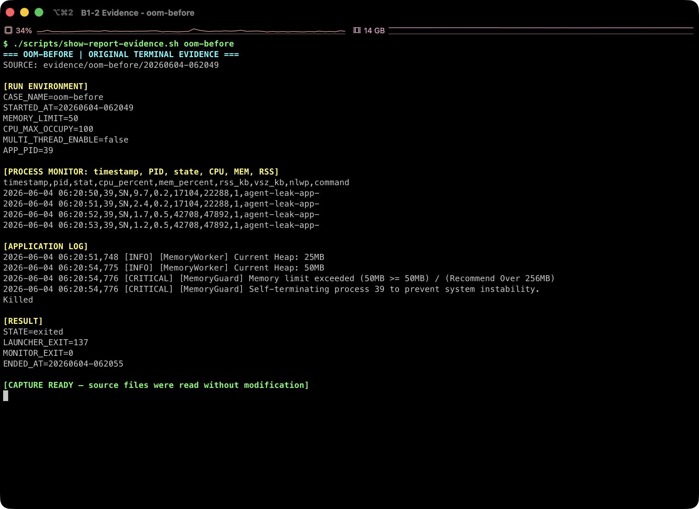
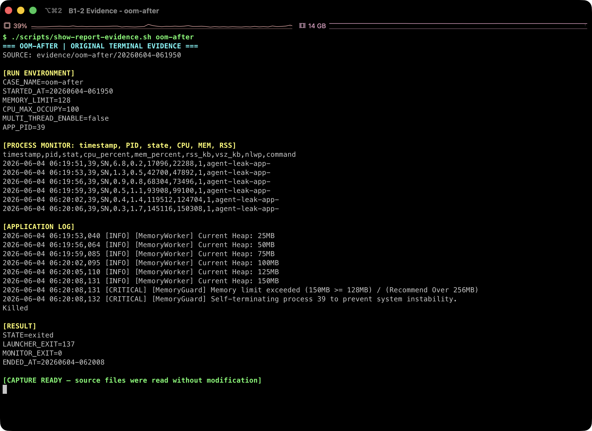

# [Bug] OOM Crash - MemoryGuard가 메모리 누수성 증가를 감지해 프로세스를 강제 종료

## 1. Description (현상 설명)

`agent-leak-app`을 `MEMORY_LIMIT=50`으로 실행하면 부트 시퀀스는 모두 통과하지만, 워크로드 시작 후 약 5초 안에 프로세스가 종료된다. 실행 로그에는 `MemoryWorker`의 Heap 값이 25MB에서 50MB로 증가한 직후 `MemoryGuard`가 임계치 초과를 감지하고 self-termination을 수행한 기록이 남았다.

비교 실행으로 `MEMORY_LIMIT=128`을 적용하면 동일한 메모리 증가 패턴이 더 오래 지속되며, 150MB 시점에서 128MB 제한을 초과해 종료된다. 따라서 종료 원인은 OS의 불특정 OOM Killer가 아니라 애플리케이션 내부의 MemoryGuard 정책으로 판단된다.

## 2. Evidence & Logs (증거 자료)

### 2.1 Before: `MEMORY_LIMIT=50`



원본 증거: [실행 조건과 PID](../evidence/oom-before/20260604-062049/run.env) · [RSS 모니터링 CSV](../evidence/oom-before/20260604-062049/monitor.csv) · [애플리케이션 로그](../evidence/oom-before/20260604-062049/app.log) · [종료 결과](../evidence/oom-before/20260604-062049/result.env) · [top 로그](../evidence/oom-before/20260604-062049/top.log)

Before 실행 조건:

```text
MEMORY_LIMIT=50
CPU_MAX_OCCUPY=100
MULTI_THREAD_ENABLE=false
```

Before 실행 로그 핵심 구간:

```text
2026-06-04 06:20:51,748 [INFO] [MemoryWorker] Current Heap: 25MB
2026-06-04 06:20:54,775 [INFO] [MemoryWorker] Current Heap: 50MB
2026-06-04 06:20:54,776 [CRITICAL] [MemoryGuard] Memory limit exceeded (50MB >= 50MB) / (Recommend Over 256MB)
2026-06-04 06:20:54,776 [CRITICAL] [MemoryGuard] Self-terminating process 39 to prevent system instability.
Killed
```

Before `monitor.csv` 요약:

```text
first=17104KB at 2026-06-04 06:20:50
last=42708KB at 2026-06-04 06:20:53
max=42708KB at 2026-06-04 06:20:52
```

### 2.2 After: `MEMORY_LIMIT=128`



원본 증거: [실행 조건과 PID](../evidence/oom-after/20260604-061950/run.env) · [RSS 모니터링 CSV](../evidence/oom-after/20260604-061950/monitor.csv) · [애플리케이션 로그](../evidence/oom-after/20260604-061950/app.log) · [종료 결과](../evidence/oom-after/20260604-061950/result.env) · [top 로그](../evidence/oom-after/20260604-061950/top.log)

After 실행 조건:

```text
MEMORY_LIMIT=128
CPU_MAX_OCCUPY=100
MULTI_THREAD_ENABLE=false
```

After 실행 로그 핵심 구간:

```text
2026-06-04 06:19:53,040 [INFO] [MemoryWorker] Current Heap: 25MB
2026-06-04 06:19:56,064 [INFO] [MemoryWorker] Current Heap: 50MB
2026-06-04 06:19:59,085 [INFO] [MemoryWorker] Current Heap: 75MB
2026-06-04 06:20:02,095 [INFO] [MemoryWorker] Current Heap: 100MB
2026-06-04 06:20:05,110 [INFO] [MemoryWorker] Current Heap: 125MB
2026-06-04 06:20:08,131 [INFO] [MemoryWorker] Current Heap: 150MB
2026-06-04 06:20:08,131 [CRITICAL] [MemoryGuard] Memory limit exceeded (150MB >= 128MB) / (Recommend Over 256MB)
2026-06-04 06:20:08,132 [CRITICAL] [MemoryGuard] Self-terminating process 39 to prevent system instability.
Killed
```

After `monitor.csv` 요약:

```text
first=17096KB at 2026-06-04 06:19:51
last=145116KB at 2026-06-04 06:20:07
max=145116KB at 2026-06-04 06:20:06
```

## 3. Root Cause Analysis (원인 분석)

`MemoryWorker` 로그에서 Heap이 25MB 단위로 지속 증가한다. `monitor.csv`의 RSS도 50MB 제한 실행에서는 약 17MB에서 42MB까지, 128MB 제한 실행에서는 약 17MB에서 145MB까지 증가했다. 메모리 사용량이 제한값 근처에 도달하자 MemoryGuard가 자체 보호 정책으로 프로세스를 종료했다.

OS 관점에서는 프로세스의 힙/가상 메모리 영역이 계속 커지면 물리 메모리 압박이 발생하고, 시스템 전체 안정성이 나빠질 수 있다. 이 애플리케이션은 그 전에 `MEMORY_LIMIT` 값을 기준으로 자체 종료하여 시스템 전체 OOM으로 확산되는 것을 막도록 설계된 것으로 보인다.

## 4. Workaround & Verification (조치 및 검증)

임시 조치로 `MEMORY_LIMIT`을 50MB에서 128MB로 상향했다.

Before/After 비교:

| 항목 | Before | After |
| --- | ---: | ---: |
| `MEMORY_LIMIT` | 50MB | 128MB |
| 마지막 Heap 로그 | 50MB | 150MB |
| 최대 RSS 관측값 | 42,708KB | 145,116KB |
| 종료 원인 | MemoryGuard | MemoryGuard |
| 생존 시간 | 약 5초 | 약 17초 |

상향 조정 후 프로세스는 더 오래 생존했지만, Heap 증가 패턴 자체는 사라지지 않았다. 근본 해결은 애플리케이션 코드에서 장기 보관 컬렉션, 캐시, 버퍼 등을 해제하거나 상한 정책을 두는 것이다. 운영 임시 조치로는 `MEMORY_LIMIT`을 서비스 특성에 맞게 256MB 이상으로 설정하고, RSS 증가율을 모니터링해 재시작/알림 정책을 함께 두는 것이 필요하다.
