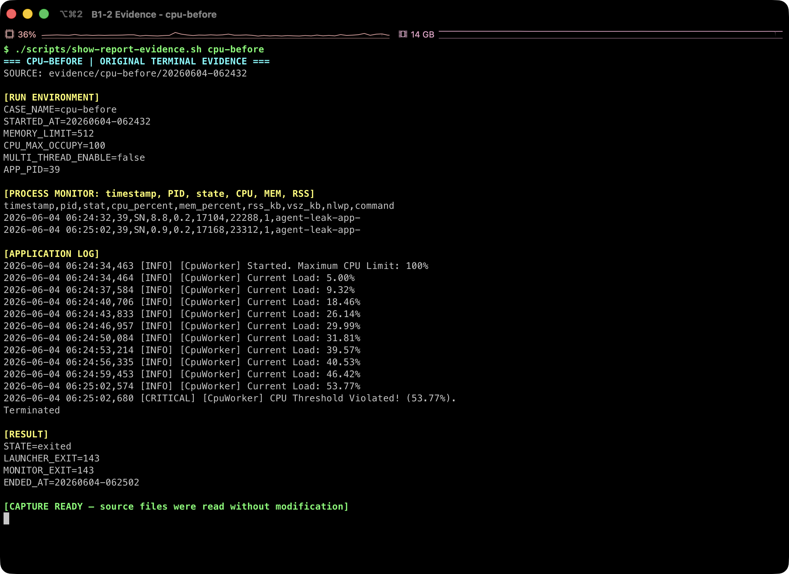
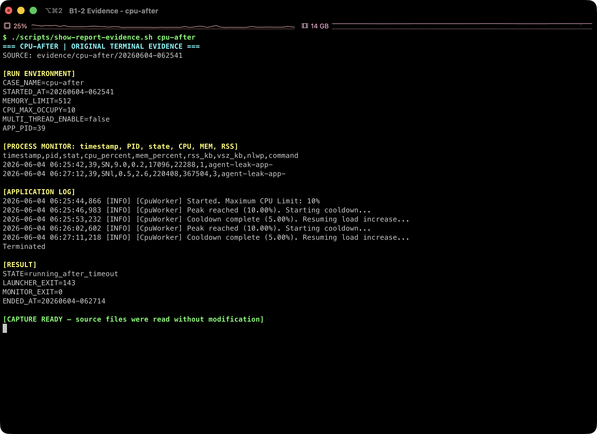

# [Bug] CPU Latency - 과도한 CPU 목표 설정으로 CpuWorker 임계치 위반 후 Watchdog성 종료

## 1. Description (현상 설명)

`agent-leak-app`을 `CPU_MAX_OCCUPY=100`으로 실행하면 부트 시퀀스에서 CPU 설정 경고가 표시되고, `CpuWorker`의 내부 부하 값이 5.00%에서 53.77%까지 상승한 뒤 `CPU Threshold Violated` 로그와 함께 프로세스가 종료된다.

`CPU_MAX_OCCUPY=10`으로 낮춘 after 실행에서는 부하가 10%에 도달할 때마다 cooldown으로 전환되며 90초 관찰 시간 동안 임계치 위반 없이 살아 있었다.

## 2. Evidence & Logs (증거 자료)

### 2.1 Before: `CPU_MAX_OCCUPY=100`



원본 증거: [실행 조건과 PID](../evidence/cpu-before/20260604-062432/run.env) · [프로세스 모니터링 CSV](../evidence/cpu-before/20260604-062432/monitor.csv) · [애플리케이션 로그](../evidence/cpu-before/20260604-062432/app.log) · [종료 결과](../evidence/cpu-before/20260604-062432/result.env) · [top 로그](../evidence/cpu-before/20260604-062432/top.log)

Before 실행 조건:

```text
MEMORY_LIMIT=512
CPU_MAX_OCCUPY=100
MULTI_THREAD_ENABLE=false
```

Before 부트 경고:

```text
[ CPU    ] Limit: 100%  		[ WARNING: Recommend Under 50% ]
```

Before 실행 로그 핵심 구간:

```text
2026-06-04 06:24:34,463 [INFO] [CpuWorker] Started. Maximum CPU Limit: 100%
2026-06-04 06:24:34,464 [INFO] [CpuWorker] Current Load: 5.00%
2026-06-04 06:24:37,584 [INFO] [CpuWorker] Current Load: 9.32%
2026-06-04 06:24:40,706 [INFO] [CpuWorker] Current Load: 18.46%
2026-06-04 06:24:43,833 [INFO] [CpuWorker] Current Load: 26.14%
2026-06-04 06:24:46,957 [INFO] [CpuWorker] Current Load: 29.99%
2026-06-04 06:24:50,084 [INFO] [CpuWorker] Current Load: 31.81%
2026-06-04 06:24:53,214 [INFO] [CpuWorker] Current Load: 39.57%
2026-06-04 06:24:56,335 [INFO] [CpuWorker] Current Load: 40.53%
2026-06-04 06:24:59,453 [INFO] [CpuWorker] Current Load: 46.42%
2026-06-04 06:25:02,574 [INFO] [CpuWorker] Current Load: 53.77%
2026-06-04 06:25:02,680 [CRITICAL] [CpuWorker] CPU Threshold Violated! (53.77%).
Terminated
```

Before `monitor.csv` / `top.log` 관찰:

```text
ps_cpu_first=8.8% at 2026-06-04 06:24:32
ps_cpu_last=0.9% at 2026-06-04 06:25:02
ps_cpu_max=8.8% at 2026-06-04 06:24:32
```

컨테이너의 `ps`/`top` 샘플은 nice=10으로 낮춰진 프로세스의 host-visible CPU 사용률을 낮게 포착했지만, 애플리케이션 Watchdog 판단 기준인 `CpuWorker Current Load`는 53.77%까지 증가했다.

### 2.2 After: `CPU_MAX_OCCUPY=10`



원본 증거: [실행 조건과 PID](../evidence/cpu-after/20260604-062541/run.env) · [프로세스 모니터링 CSV](../evidence/cpu-after/20260604-062541/monitor.csv) · [애플리케이션 로그](../evidence/cpu-after/20260604-062541/app.log) · [종료 결과](../evidence/cpu-after/20260604-062541/result.env) · [top 로그](../evidence/cpu-after/20260604-062541/top.log)

After 실행 조건:

```text
MEMORY_LIMIT=512
CPU_MAX_OCCUPY=10
MULTI_THREAD_ENABLE=false
```

After 실행 로그 핵심 구간:

```text
2026-06-04 06:25:44,866 [INFO] [CpuWorker] Started. Maximum CPU Limit: 10%
2026-06-04 06:25:44,866 [INFO] [CpuWorker] Current Load: 5.00%
2026-06-04 06:25:46,983 [INFO] [CpuWorker] Peak reached (10.00%). Starting cooldown...
2026-06-04 06:25:47,991 [INFO] [CpuWorker] Current Load: 10.00%
2026-06-04 06:25:53,232 [INFO] [CpuWorker] Cooldown complete (5.00%). Resuming load increase...
...
2026-06-04 06:27:12,225 [INFO] [CpuWorker] Current Load: 5.00%
Terminated
```

After `result.env`:

```text
STATE=running_after_timeout
ENDED_AT=20260604-062714
```

`Terminated`는 Watchdog 종료가 아니라 evidence runner가 90초 스냅샷을 확보한 뒤 종료한 결과다.

## 3. Root Cause Analysis (원인 분석)

`CPU_MAX_OCCUPY=100`은 부트 단계에서 권장 범위를 벗어난 값으로 경고된다. 이 설정에서는 `CpuWorker`가 부하를 계속 높이다가 내부 보호 임계값으로 보이는 50%대를 넘고, `CPU Threshold Violated`를 기록한 뒤 종료된다.

CPU 과점유는 OS 스케줄러 관점에서 다른 프로세스의 run queue 대기 시간을 늘리고, 같은 호스트의 응답 지연을 유발한다. 이 앱은 `CpuWorker` 부하가 보호 임계치를 넘으면 프로세스를 종료해 시스템 전체 지연을 줄이는 Watchdog성 보호 조치를 수행한다.

## 4. Workaround & Verification (조치 및 검증)

임시 조치로 `CPU_MAX_OCCUPY`를 100%에서 10%로 낮췄다.

Before/After 비교:

| 항목 | Before | After |
| --- | ---: | ---: |
| `CPU_MAX_OCCUPY` | 100% | 10% |
| 최대 앱 부하 로그 | 53.77% | 10.00% |
| 보호 동작 | `CPU Threshold Violated` 후 종료 | 10% 도달 시 cooldown |
| 실행 결과 | 약 30초 후 종료 | 90초 관찰 동안 생존 |

운영 임시 조치로는 `CPU_MAX_OCCUPY`를 50% 미만으로 제한하고, CPU 부하가 특정 임계치에 접근하면 cooldown 또는 rate-limit이 먼저 동작하도록 설정한다. 근본 해결은 CPU 집약 작업을 작은 단위로 쪼개고, 워커 동시성/큐 처리량에 상한을 두는 것이다.
