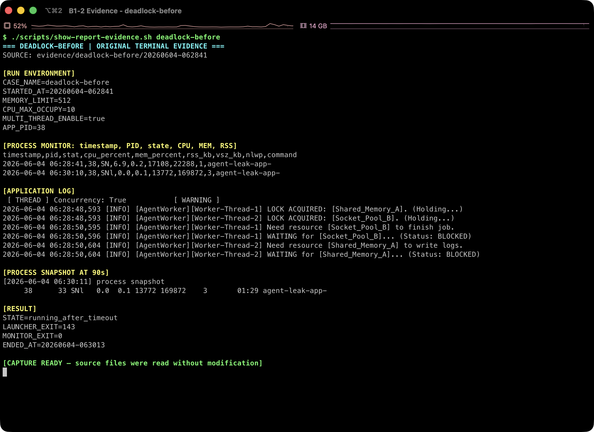
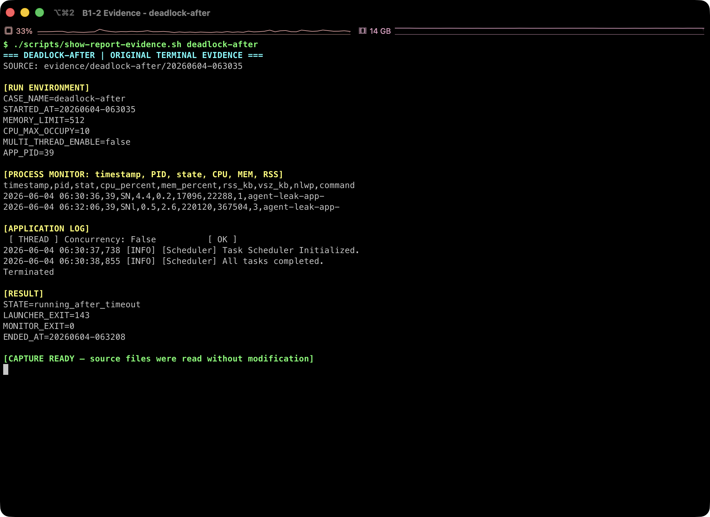

# [Bug] Deadlock - 멀티스레드 모드에서 두 워커가 상대 자원을 기다리며 무응답 상태 지속

## 1. Description (현상 설명)

`MULTI_THREAD_ENABLE=true`로 실행하면 부트 단계에서 concurrent mode 경고가 표시된다. 이후 `Worker-Thread-1`은 `Shared_Memory_A`를 점유한 상태에서 `Socket_Pool_B`를 기다리고, `Worker-Thread-2`는 `Socket_Pool_B`를 점유한 상태에서 `Shared_Memory_A`를 기다린다.

마지막 로그가 두 스레드의 `WAITING ... BLOCKED` 상태에서 멈춘 뒤, 90초 관찰 종료 시점까지 PID는 존재하지만 CPU/MEM 변화와 추가 로그가 없다. 이는 전형적인 circular wait 기반 Deadlock이다.

## 2. Evidence & Logs (증거 자료)

### 2.1 Before: `MULTI_THREAD_ENABLE=true`



원본 증거: [실행 조건과 PID](../evidence/deadlock-before/20260604-062841/run.env) · [프로세스 모니터링 CSV](../evidence/deadlock-before/20260604-062841/monitor.csv) · [애플리케이션 로그](../evidence/deadlock-before/20260604-062841/app.log) · [90초 프로세스 스냅샷](../evidence/deadlock-before/20260604-062841/process_snapshot.txt) · [종료 결과](../evidence/deadlock-before/20260604-062841/result.env) · [스레드 로그](../evidence/deadlock-before/20260604-062841/threads.log)

Before 실행 조건:

```text
MEMORY_LIMIT=512
CPU_MAX_OCCUPY=10
MULTI_THREAD_ENABLE=true
```

Before 부트 경고:

```text
[ THREAD ] Concurrency: True 		[ WARNING ]
>>> SYSTEM WARNING: POTENTIAL DEADLOCK IN CONCURRENT MODE.
```

Before 실행 로그 마지막 구간:

```text
2026-06-04 06:28:48,593 [INFO] [AgentWorker][Worker-Thread-1] LOCK ACQUIRED: [Shared_Memory_A]. (Holding...)
2026-06-04 06:28:48,593 [INFO] [AgentWorker][Worker-Thread-2] LOCK ACQUIRED: [Socket_Pool_B]. (Holding...)
2026-06-04 06:28:50,595 [INFO] [AgentWorker][Worker-Thread-1] Need resource [Socket_Pool_B] to finish job.
2026-06-04 06:28:50,596 [INFO] [AgentWorker][Worker-Thread-1] WAITING for [Socket_Pool_B]... (Status: BLOCKED)
2026-06-04 06:28:50,604 [INFO] [AgentWorker][Worker-Thread-2] Need resource [Shared_Memory_A] to write logs.
2026-06-04 06:28:50,604 [INFO] [AgentWorker][Worker-Thread-2] WAITING for [Shared_Memory_A]... (Status: BLOCKED)
```

Before `monitor.csv` 처음/마지막 행:

```text
first=2026-06-04 06:28:41,38,SN,6.9,0.2,17108,22288,1,agent-leak-app-
last=2026-06-04 06:30:10,38,SNl,0.0,0.1,13772,169872,3,agent-leak-app-
```

Before `process_snapshot.txt`:

```text
agent         38      33  0 06:28 ?        00:00:00 /work/agent-app-leak/agent-leak-app-arm64

PID    PPID STAT %CPU %MEM   RSS    VSZ NLWP     ELAPSED COMMAND
38      33 SNl   0.0  0.1 13772 169872    3       01:29 agent-leak-app-

PID     TID STAT %CPU %MEM COMMAND
38      38 SNl   0.0  0.1 agent-leak-app-
38     120 SNl   0.0  0.1 agent-leak-app-
38     121 SNl   0.0  0.1 agent-leak-app-
```

마지막 의미 있는 애플리케이션 로그는 `06:28:50.604`이고, `06:30:10` 모니터 행과 `06:30:11` 스냅샷에서도 PID 38이 존재한다. 약 80초 동안 새 작업 로그 없이 CPU 0.0%, RSS 13,772KB가 유지되므로 “종료”가 아니라 “살아 있지만 진행하지 못하는 상태”로 판정했다.

### 2.2 After: `MULTI_THREAD_ENABLE=false`



원본 증거: [실행 조건과 PID](../evidence/deadlock-after/20260604-063035/run.env) · [프로세스 모니터링 CSV](../evidence/deadlock-after/20260604-063035/monitor.csv) · [애플리케이션 로그](../evidence/deadlock-after/20260604-063035/app.log) · [90초 프로세스 스냅샷](../evidence/deadlock-after/20260604-063035/process_snapshot.txt) · [종료 결과](../evidence/deadlock-after/20260604-063035/result.env) · [스레드 로그](../evidence/deadlock-after/20260604-063035/threads.log)

After 실행 조건:

```text
MEMORY_LIMIT=512
CPU_MAX_OCCUPY=10
MULTI_THREAD_ENABLE=false
```

After 정상 실행 로그:

```text
[ THREAD ] Concurrency: False 		[ OK ]
2026-06-04 06:30:37,738 [INFO] [Scheduler] Task Scheduler Initialized.
2026-06-04 06:30:37,739 [INFO] [Scheduler] Registered Tasks: ['Thread-A', 'Thread-B', 'Thread-C']
2026-06-04 06:30:38,855 [INFO] [Scheduler] All tasks completed.
```

After `result.env`:

```text
STATE=running_after_timeout
ENDED_AT=20260604-063208
```

## 3. Root Cause Analysis (원인 분석)

로그상 자원 대기 순서는 다음과 같다.

1. `Worker-Thread-1`이 `Shared_Memory_A`를 점유한다.
2. `Worker-Thread-2`가 `Socket_Pool_B`를 점유한다.
3. Thread-1은 작업 완료를 위해 Thread-2가 점유한 `Socket_Pool_B`를 기다린다.
4. Thread-2는 로그 기록을 위해 Thread-1이 점유한 `Shared_Memory_A`를 기다린다.

이 상태는 Deadlock 4대 조건을 만족한다.

- 상호 배제: 두 자원은 동시에 하나의 스레드만 점유한다.
- 점유 대기: 각 스레드는 이미 하나의 자원을 들고 다른 자원을 기다린다.
- 비선점: 상대 스레드가 잡은 자원을 강제로 빼앗지 못한다.
- 순환 대기: Thread-1 -> Socket_Pool_B -> Thread-2 -> Shared_Memory_A -> Thread-1 순환이 생긴다.

따라서 프로세스는 죽지 않았지만 진행도 하지 못하는 무응답 상태가 된다.

## 4. Workaround & Verification (조치 및 검증)

임시 조치로 `MULTI_THREAD_ENABLE`을 `true`에서 `false`로 변경했다. 이 설정에서는 concurrent lock 경로가 실행되지 않고, 스케줄러 작업이 정상 완료된다.

Before/After 비교:

| 항목 | Before | After |
| --- | --- | --- |
| `MULTI_THREAD_ENABLE` | true | false |
| 마지막 의미 있는 로그 | 두 워커 모두 `WAITING ... BLOCKED` | `Scheduler All tasks completed` |
| PID 상태 | 90초 뒤에도 살아 있음 | 90초 동안 정상 워크로드 진행 |
| 스레드 관측 | 3개 스레드, CPU 0.0% 정체 | 3개 스레드, Memory/CpuWorker 계속 진행 |

근본 해결은 모든 스레드가 동일한 순서로 락을 획득하도록 강제하거나, 락 획득에 timeout/backoff를 적용하고 실패 시 이미 획득한 락을 해제하도록 만드는 것이다.
